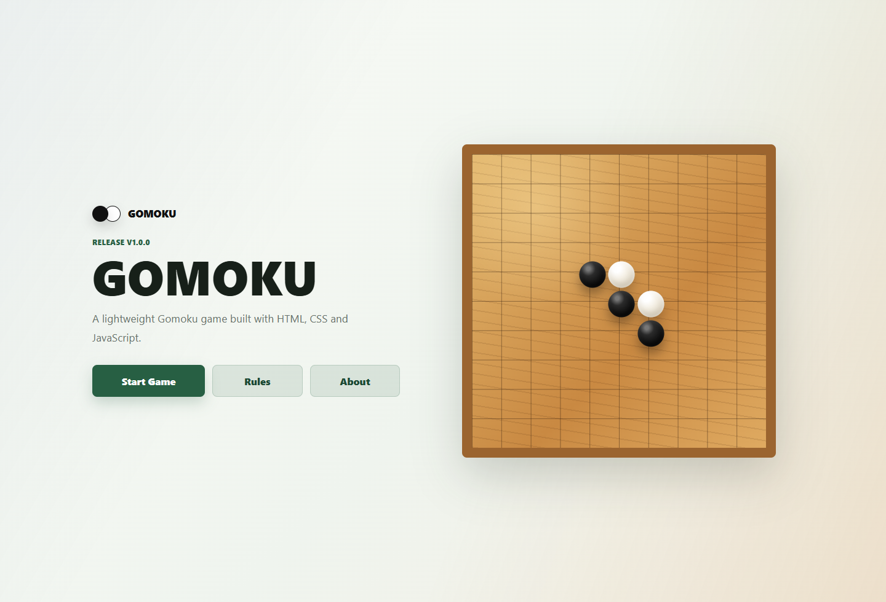

# GOMOKU

A lightweight Gomoku game built with HTML, CSS and JavaScript.

Current version: `v2.1.1`

Created by Binbin. Built with AI collaboration.

## Project Screenshot



## Features

- Local Two Player mode
- Play with AI mode
- Player is black and moves first in AI mode
- AI plays white with a short thinking delay
- 15 x 15 Gomoku board with accurate intersection-based placement
- Win detection in horizontal, vertical, and diagonal directions
- Desktop hover preview before placing a stone
- Mobile and tablet touch-optimized board input
- Animated last-move highlight
- Undo
- Restart confirmation dialog
- Winner and draw dialogs without `alert`
- Local Web Audio sound effects with a sound toggle
- Top match bar with wins, moves, timer, and current turn
- Responsive layout for desktop, tablet, and mobile
- Offline-first static project with no CDN and no external runtime dependency

## Game Modes

### Local Two Player

Two players take turns on the same device. Black moves first. Undo removes one move.

### Play with AI

The human player is black and moves first. The AI is white and moves after a 300-600 ms thinking delay. Undo removes the latest AI move and the latest human move. If only one human move exists, undo removes that single move.

## AI Strategy

The v2.x AI uses a basic scoring engine:

- Win immediately if white can make five in a row.
- Block immediately if black can make five in a row.
- Prefer forming or blocking four-in-a-row.
- Prefer forming or blocking open three patterns.
- Prefer moves near existing stones.
- Prefer center-area moves when other scores are similar.

The AI is designed to feel reasonable, not unbeatable.

## Mobile Support

GOMOKU v2.1.1 supports responsive mobile and tablet play:

- The board scales to the available viewport width.
- Touch input resolves to the nearest board intersection.
- Hover preview is disabled on touch-only devices.
- Buttons and dialogs use touch-friendly sizing.
- Board touch gestures avoid double-tap zoom and long-press selection during play.

## Browser Compatibility

Test targets:

- PC: Chrome, Edge, Safari, Firefox
- iPhone: Safari and Chrome
- Android: Chrome and Edge
- Tablet: iPad Safari and Android tablet browsers

The project uses standard HTML5, CSS3, and ES6 JavaScript only. It does not require a build step, a package manager, a CDN, or a network connection.

## Run Locally

No installation is required.

1. Download or clone this repository.
2. Open the project folder.
3. Double-click `index.html`.

## Local Mobile Testing

Recommended options:

1. Open `index.html` directly on the phone if the files are copied to the device.
2. Use a local static server from the project folder and open the LAN address on your phone.
3. Use desktop browser device emulation for a quick layout check.

When testing on a phone, check portrait and landscape orientation, Local Two Player, Play with AI, undo, restart, winner dialog, sound toggle, and edge/corner board taps.

## GitHub Pages Deployment

This project is a static website and remains compatible with GitHub Pages.

1. Push the project to a GitHub repository.
2. Open `Settings` -> `Pages`.
3. Set `Source` to `Deploy from a branch`.
4. Select the branch that contains `index.html`.
5. Keep the folder as `/root`.
6. Save and wait for GitHub Pages to publish the site.

## Project Structure

```text
Gomoku/
|-- assets/
|   |-- favicon.svg
|   `-- project-screenshot.png
|-- backups/
|-- docs/
|   `-- versioning.md
|-- index.html
|-- style.css
|-- script.js
|-- CHANGELOG.md
|-- README.md
`-- LICENSE
```

## Roadmap

- Stronger AI difficulty levels
- Optional move record export
- Accessibility refinements
- Online play in a future major version

## License

This project is released under the MIT License. See [LICENSE](LICENSE) for details.
